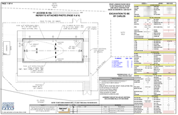
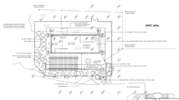
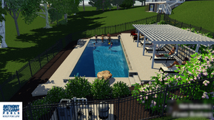
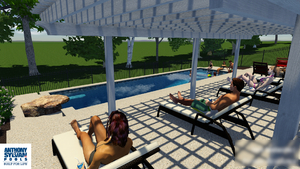
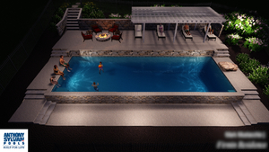
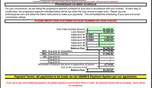

* Table of Contents
{:toc}

# Site Plan

The first two shown here are actual construction plans. The third is what was used during the sale process; the fire pit and pergola were not priced into the initial build.

## Project Renders

Below are renders from a 3D video that was used during the sale process.

# Budget

We were very clear that our top budget was $125,000, and the sales guy agreed to work to this. In the end we spent $147,000 total to get the pool up and running.

Here's the budget. "AS" here indicates payment to Anthony Sylvan. All other payments were to other contractors, some of whom were Anthony Sylvan subcontractors. 

| Item | Amount | Running Total |
|---|---|---|
| AS Deposit |	$10,000.00 | $10,000.00 |
| Tree Removal | $2,500.00 | $12,500.00 |
| Geo Permit Work | $2,750.00 | $15,250.00 | 
| AS payment 1 | $34,306.00 | $49,556.00 |
| AS addendum (raised beam) | $4,714.00 | $54,270.00 |
| Excavator tree roots Removal | $1,200.00 | $55,470.00 |
| Retaining wall deposit 20% | $3,700.00 | $59,170.00 |
| AS addendum (steps, extra patio) | $2,879.00 | $62,049.00 |
| AS payment 2 | $47,170.00 | $109,219.00 |
| Retaining wall final payment | $14,800.00 | $124,019.00 |
| Electricians - extra trench |	$1,450.00 | $125,469.00 |
| Electrician - panel |	$450.00 | $125,919.00 |
| AS payment miscalculation | $501.00 | $126,420.00 |
| AS pool cover | $5,900.00 | $132,320.00 |
| Additional to paver company for steps, drain | $4,175.00 | $136,495.00 |
| AS final payment | $4,288.00 | $140,783.00 |
| Pool water | $1,755.00 | $142,538.00 |
| Fence | $5,000.00 | $147,538.00 |

## Payment Schedule

Anthony Sylvan has an aggressive payment schedule - 95% is due before the Gunnite is even poured. 

