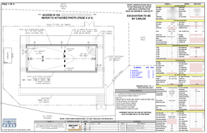
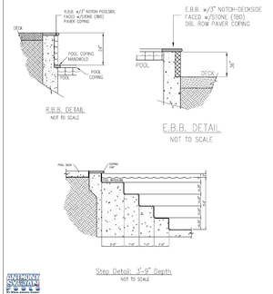
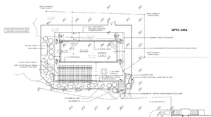
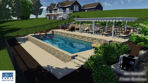
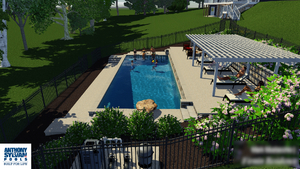
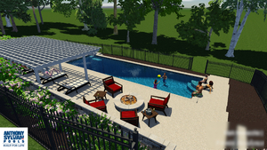
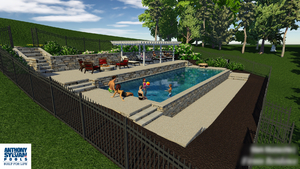
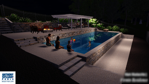
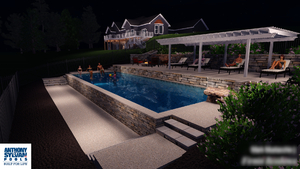

* Table of Contents
{:toc}

# Site Plan

The first two shown here are actual construction plans. The third is what was used during the sale process; the fire pit and pergola were not priced into the initial build.

## Project Renders

Below are renders from a 3D video that was used during the sale process.

