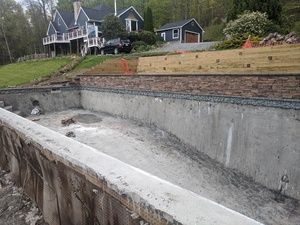
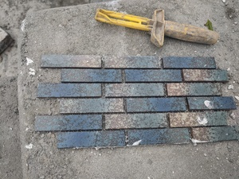
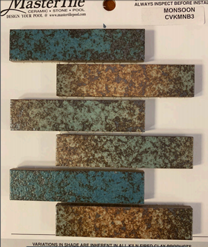

# Issue - Tile Not Matching Sample

This is a relatively minor issue to start with (but we really get into it soon). We were presented a catalog of 100+ different tile samples (via dropbox). There were many mosaic patterns. We chose one that we thought would be striped, thinking that the large tiles and solid colors shown in the sample meant that it wouldn't be a mosaic design. 

I noticed the discrepency from the window when the tilers had started; I asked them for the number of the tile, and sure enough it matched the sample number, so I let them continue. The end result of the tiles is _fine_, just not what we'd anticipated.

