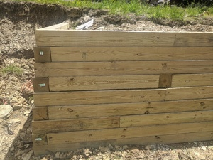
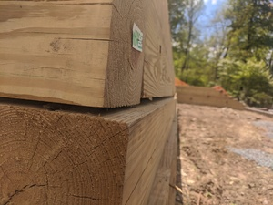

# Issue - Retaining Wall Subsidence

The retaining wall company was a subcontractor selected by Anthony Sylvan. Anthony Sylvan gave them the specification for the build. They presented me with an estimate. I approved the estimate and paid them directly.

The retaining wall was built in December. In May I noticed that large cracks were appearing between the 6x6s in the walls. I brought it to the Project Manager's attention. The retaining wall subcontractor came out to inspect, and diagnosed the issue as subsidence, caused by following Anthony Sylvan's specs to use mostly soil for backfill. The subcontractor came back out, dug out the backfill, replaced it mostly with gravel, and it has been fine since.

