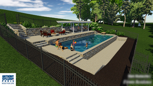
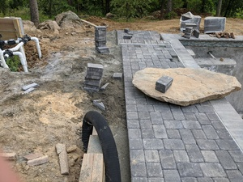

# Issue - Dive Rock

This is another relatively minor issue.

During [the sale](./02-thesale.html), the Sales Guy and I had talked specifically about large rocks being used as part of the patio (japanese landscaping style), since we live on a granite mountain; we also talked about a large rock being used for the diving rock at the deep end of the pool. (By the time of the design meeting, the rocks had vanished from the design, except for the diving rock, which remained reasonably large in the render and [plans](./00-siteplans-budget.html).)

During the construction break over the winter, I emailed the Project Manager a few times, trying to pin him down on specifics for how the large rock would be maneuvered into place, since we'd never talked about it specifically. He never engaged.

In May, when the deck crew started, they point blank refused to use any of the larger rocks available on the site, because their small(ish) Bobcat was unable to move them. On the Project Manager's May site visit, I compromised on a fairly low rock which was right next to the site, which I now regret. So, we ended up with a basically ornamental rock rather than a functional dive rock.

Compare the renders of the dive rock (in particular, the height) with the actual result, below. The renders have the height at roughly 2 feet; the actual is around 8 inches. It's _fine_, it's just another example of a detail that wasn't built as it was originally designed.

