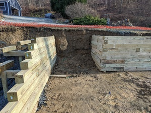
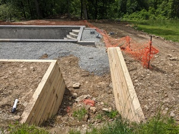

# Issue - Stairs Weren't Priced In

I rated this "high", because it cost me around $4k in upcharge to resolve (along with a drain that also wasn't priced in). 

In the lead-up to the deck paving beginning, it became apparent that nobody either had built the main steps from the driveway to the patio, or was planning to. I raised this to Project Manager, who - true to form - had nothing to offer on the subject. I then talked to Patio Subcontractor Chief when he was doing his initial on-site, and he said that it wasn't in his scope of work, and that it'd cost extra. 

Sales Guy had organized the two relevant subcontractors here, so I wanted to talk to him and see what had happened. (The retaining wall subcontractor was "supposed" to have built the steps, and was given specifications by Sales Guy, although I signed the subcontract and paid them directly; the patio subcontractor was entirely subcontracted under Anthony Sylvan, and built into their main billing.) It took me over a week to get Sales Guy on the phone - he was being extra slippery at this point, as Project Manager was dropping the ball over and over and the project was not going well. 

When I finally did get Sales Guy on the phone, he spent 45 minutes blaming the retaining wall subcontractor for not building the stairs, which he claimed should have been pressure treated wood, like the retaining wall. I pointed out that both the render and the plan made the stairs look like they were stone, just like the other stairs in the project. He blew that off. He wouldn't accept responsibility for the mistake.

I ended up paying to move the project forward, as it was held up at this point.

