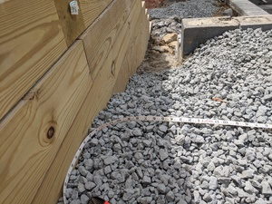

# Dimensions of the Deck

After Project Manager visited the site in early May (prior to the patio crew being due to start), I decided to measure the patio area to make sure there were no issues. It turns out there were - the patio area was an extra 3-4 feet long in width.

Most of the extra width had been added to the north of the pool (the shallow end), and so there were now questions about how the stairs from the driveway would transition to the patio deck, and/or the deck to the path on the side. I sent an email to Project Manager and Sales Guy, asking for design changes; Project Manager verbally told me that "[he's] not a numbers guy" and that "I should speak to [Sales Guy]." Sales Guy took 10 days before getting on the phone, and when we did finally talk he hadn't read the email about the dimensions while looking at the plan, and had no good inputs. 

The deck crew started work with this all unresolved, and made a major screwup as a result (covered in next issue).

Compare site plan to measurement below:

