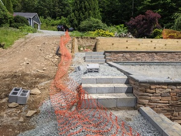

# Stair Widths

The patio crew began work. I assumed that Project Manager, Sales Guy & Patio Subcontractor Chief had actually discussed [the issue with the dimensions](./08-dimensions.html), given the 10 day delay, emails, phone conversations, and in person meeting with Patio Subcontractor Chief where we had discussed the dimension mismatch. But apparently not.

One thing to understand is that there are (generally) no decision makers on-site with the subcontractor crews. They're given a job to do, and have to improvise on site to make it happen. Anthony Sylvan's project management is nowhere to be seen if issues come up. The crews apparently won't come talk to the home-owner. Issues like this are the result. There are photos at several stages of the unfolding disaster here; in the early ones, I just assumed that things would be made right as the build-out continued; towards the end of this batch of photos, I got pissed and escalated to the CEO. (More below the images).

The last two images are identical; I've marked up the last one with annotations to walk through what was going on here. Flip back and forth between them. Numbers in the image correspond with explanations below: 

1) The retaining walls around the stairs from the driveway were built at a 6' width; they should have been around 5'.

2) The patio deck had been framed with 3-4' of extra width, some of which was on the shallow end of the pool. The path was [supposed to](00-site-plans.html) to be 5' wide, but there was just over 6' of space for the path if it was to line up with the driveway stairs at the north/left of these images. So the first mistake here was that the crew tried to build a little "cliff" wall to the left of the stairs here to fill in that space. Not entirely clear what it would have descended onto...flower beds? Graded slope?

3,4) The next problem is that the two sets of steps (3 vs 4) were different widths - a 4" difference in width when measured from the inside pool wall to outer step. This came from a measuring mistake that the original step builders made (the corner of the pool wall was a little wider than the regular coping section, and that's where they measured from.) You can see that the path going back from #4 would have ended up in a weird place.

5) They were also unclear about the width that the bottom section of the path should be. The tamped material isn't really wide enough for that final block that's added there, but the main run is clearly too narrow.

# The resolution

I escalated to the CEO in an email at 7AM, sending him some of the above photos, and giving some additional background. (If you're an Anthony & Sylvan customer in trouble, this is by far the quickest way that I got a response to any issue throughout the project; his email address follows the same pattern as those of the reps and sales guys you're dealing with. CC support.) Shortly after 9AM, I got my first call from Construction Manager, who as apologetic. At 9:20AM Patio Subcontractor Chief turns up on site with his crew; I point out the issue and he tells me it will be an upcharge to build it out to 6', since there's extra dimension (yeah buddy, not news - we had spoken about it multiple times previously). Annoyed (this was just days after I'd paid the upcharge for the driveway stairs and patio drain), I called back the Construction Manager and insisted that he pick up the tab - and he conceded. The path got built out to 6'.

This was not the last of the path issues, however. You'll see some of these pictures again. Look closely at them and guess at some of the additional issues that came up.
