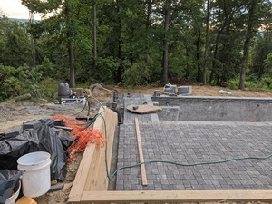
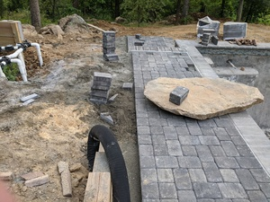
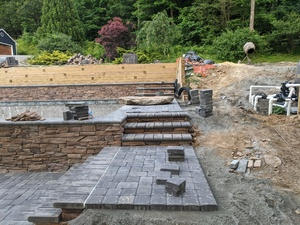

# Wobbly Path Edging Alignment

This might be just part of a regular deck build, something that's routinely remedediated. Would it have been remediated it I hadn't brought it up? We'll never know.

I should have run a line along the edges of these paths before taking the photos, but if you look closely you'll see there's variance.

