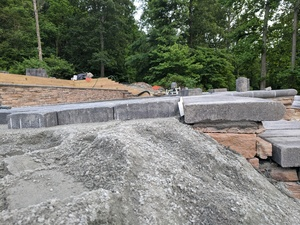

# Poor Levelling During Construction

Again, this might be just part of a regular deck build, something that's routinely remediated during levelling. Would they all have been remediated it I hadn't brought it up? We'll never know.

