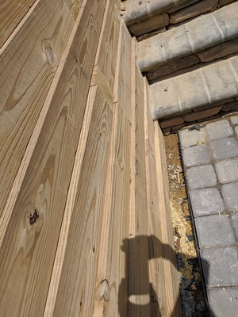
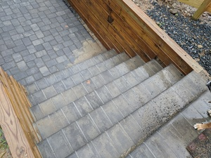
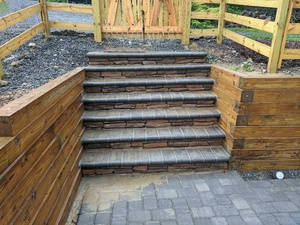
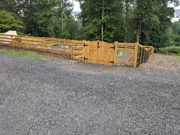
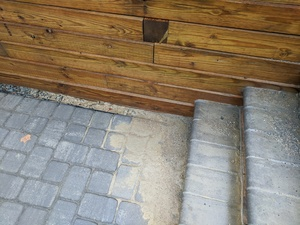
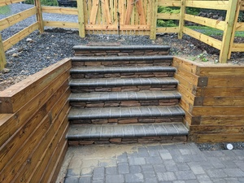

# Driveway Stairs Built Below Grade, Silt Issues 

As we [discussed previously](./07-stairs.html), there were project management issues around who was responsible for building the stairs, and I ended up paying around $4,000 in upcharge to get them built. The patio crew built them [to Anthony Sylvan spec](./00-site-plans.html) - unfortunately, the plans had miscalculated the relative grades, and so not enough steps were specified in the plan to get to grade. The patio crew, of course, didn't volunteer to build an extra step, with the result that for two months we had a slope _down_ from the gate to the first step. 

During multiple heavy rainfalls in this period, water would run down the driveway and then straight down the stairs, washing silt and gravel onto the patio deck.

This was finally rectified as a concession by the Patio Subcontractor Chief, as a way to apologize for some of the other issues that required his crew to come out over and over. (Otherwise, it would have been yet another upcharge.) The [stone pavers](./00-site-plans.html) that were shown outside the gate in the sales plan were never put in place, apparently being aspirational only.

