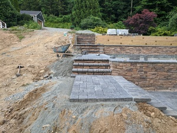
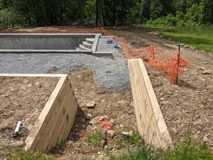

# Path Edge Failure

As you can see in the images below, the paths were built up from grade on fill, i.e. "suspended" over grade. At least along the edges, some kind of fine aggregate/compactable material was used. Loose subsoil was then backed up to the edges. In only two weeks after the paths were installed, the fill supporting the edges of the paths started to give way - not due to erosion, just due to natural compaction. This resulted in the pavers along the edges being unstable, as you can see below. The first set of pictures show the stages in the path construction, while the latter pictures show pavers coming away from the main body of the path.

This was rectified, although time will tell how permanent the fix is. 

## Construction

## Failure

