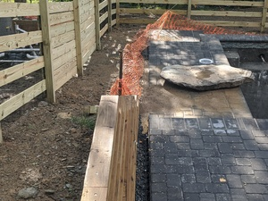
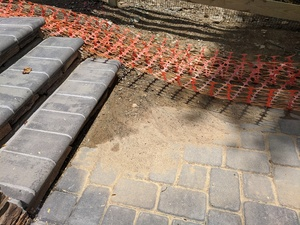
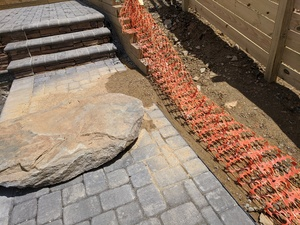
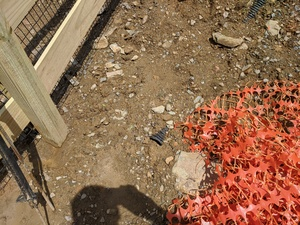

# Grading

The main issue here was that grading left new fill above the path and above the deep end of the pool. In the first thunderstorm that came by, water ran straight down the slope and onto the path, washing clay silt onto the path and into the pool. This is rated high because (I think) it affected the plaster job, as you'll see later.

I've included a pre-grading photo of the affected area too.

