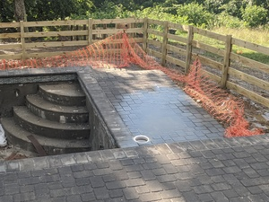

# Subsidence

Two weeks after laying the paths, we had subsidence in the middle of one. This was visible after rain, with puddling in the middle of the path. This was fixed by redoing this section of path.

