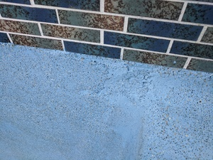
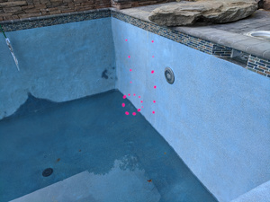

# Plaster Issues

First of all, the plaster crew were messy. They got plaster on both tiles and coping; there's still specs of plaster all the way along the handhold coping on the raised beam, even after they came back for cleanup.

Secondly, the pool was left for 18 hours without water in it (barely filling up with a dripping hose) after the initial plastering was done. The water company was originally scheduled to come out the same day as the plaster crew did their work, but a snafu led to them not arriving until 9AM the next morning (leaving the plaster to air-dry from 3PM to 9AM.) Even then, filling the pool took literally 12 hours. Two water trucks turned up originally, but the second driver refused to come back because she didn't like the steepness of our driveway (which definitely is steep, but not ridiculously so - 2WD vehicles routinely drive up it.) The other water truck made 2 additional round trips, and then broke down on the freeway, leaving him out of commission for 5 or 6 hours. He made his last run at 9PM, and then I left the hose running overnight to top up the last few inches. This all led to visible blotchiness.

(Continued below the pictures).

The above issues were largely rectified by an acid bath, which you can read about [in the timeline](./01-timeline.html)(from Jul 9th onwards). There's still some substandard areas of plaster in the main area of the pool, but it's much better than it was.

The third issue had to do with lack of pre-treatment of the abysmal looking deep end wall, both stained by clay silt and pockmarked with calcium seepage holes. Flip back and forth between these images. I've highlighted the main areas with issues in the last image (the calcium holes are large enough that you can put your finger in them; the stained plaster is visible when looking at it through the water.) These were not fixed by the acid bath and still need to be rectified.

