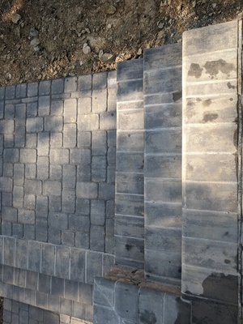
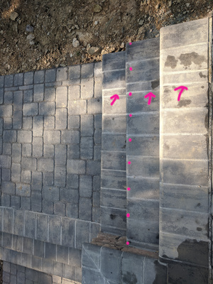

# Squint Steps

This was the bottom set of stairs on the shallow end. Flip back and forth, and notice first that the middle step is off-square by around 1 inch over the width. The second issue I highlighted was where the crew had to expand the stair widths after they [built them](./09-stairwidths.html) irregularly. 

The crew rebuilt these steps _twice_, because the first rebuild repeated the exact off-square issue that was in the original attempt. Patio Subcontractor Chief was so embarassed at this error that he "threw in" the additional stair to grade on the [driveway stairs](./07-stairs.html) for "free".

