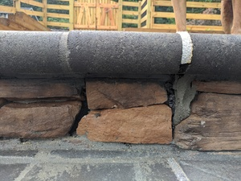
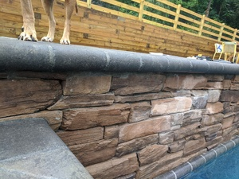
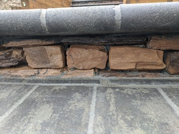
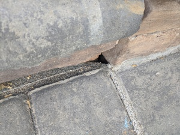
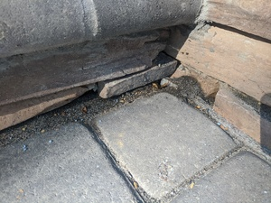
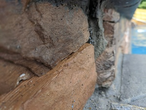

# Stonework

Rather than hire one mason and one batch of stone material to do all of the stonework, because of the way Anthony & Sylvan's subcontracting works, two different batches of stone material were ordered, and two different crews did the stonework.

The original crew did the raised beams. The patio crew did the stonework on the facing of steps. Not only is there a visible difference between the material (the steps are darker), there's a difference in quality. The raised beam stonework is tight, mostly well aligned, and (for the most part) looks like what it's trying to emulate, i.e. a stacked stone wall. The stonework on the facing of the steps is a lot sloppier, having big gaps, blobs of mortar, and no real attempt to emulate what it's supposed to represent. It's too bad that Anthony & Sylvan didn't use the same higher skilled mason to do the step facades too, and it's ludicrous that the material was ordered in two batches.

