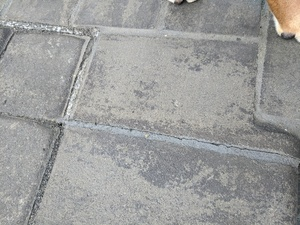
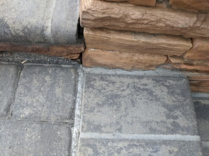
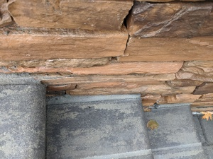

# Steps Missing Expansion Foam

The lower flights of steps (on the ends, and then the perpendicular flights on the bottom) were mortared directly to the pool walls. Pool walls have some movement to them, and expansion foam seems to be used for first year builds, replaced by caulk the next year after everything has settled. Because foam wasn't used here, the mortar cracked on every flight of steps.

