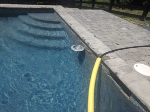

# Shallow End Pool Light Leak

The seal on the shallow end pool light was broken, and it was half full of water (not a huge surprise, given the abuse the lights got from various crews).

I reported it to Construction Manager, who referred the issue to the scheduler. The scheduler sent out the electricians next day - unfortunately the [acid bath](16-plaster.html) was going on at the time, and the electricians couldn't work. The electricians returned 2 weeks later, and were somewhat rude. One of them worked on the light, while the other hung out talking on his phone. 

The next day I noticed the pool light floating in the pool - they hadn't properly attached it. I emailed Construction Manager, and the electricians came back 2 days later and fixed it. 

